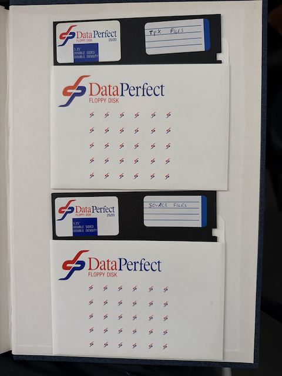
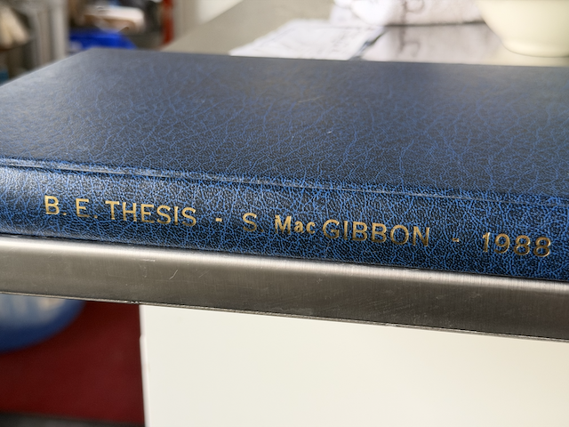
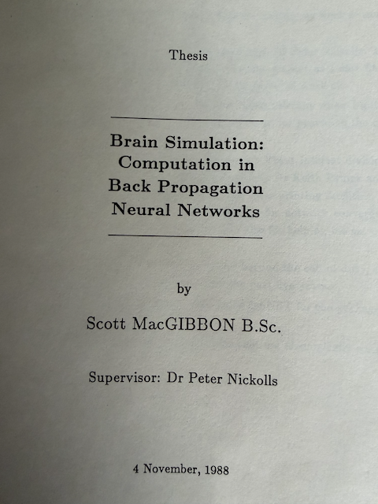

# fishNET

A back-propagation neural network simulator, written in C as an undergraduate
thesis at the University of Sydney in 1988.

**Thesis:** *Brain Simulation: Computation in Back-Propagation Neural Networks*  
**Author:** Scott MacGibbon  
**Degree:** Bachelor of Engineering, University of Sydney

The disks containing the code (and the thesis text, in TeX) have in lived in the back of the bound thesis until 2026:

<figure>
  
  <figcaption>The 5.25" disks</figcaption>
</figure>

<figure>
  
  <figcaption>My bound copy</figcaption>
</figure>

<figure>
  
  <figcaption>Title page</figcaption>
</figure>


## Contents
I used a service to extract the contents of the disks. Surprisingly, the contents came straight off, and they are uploaded here unchanged. Then, using an LLM to modernise the old K&R code that also had these fabulous relics like `#ifndef MSDOS`, from my old IBM PC XT. It did make me a tad nostaligic. For a moment.

There are two directories:

- `the-museum--from-original-disks/` — Original K&R C source as recovered from the floppy disks, kept for reference
- `a-working-antique/` — Modernised ANSI C version; this is the one to build and run

The code in the working antique directory was minimally converted to ANSI C (C89/90):

- Function definitions and declarations converted from K&R style to ANSI prototypes.
- `#ifdef MSDOS` blocks and all DOS-specific code removed throughout.
- `_control87()` and `_status87()` FPU calls removed (`error.c`, `fishnet.c`).
- `stdprn` (the DOS printer handle) replaced by `#define stdprn stderr` in `fishnet.c` and `show.c`.
- `_splitpath` and `_makepath`, and the `extension()` and `add_extension()` functions removed from `input.c`.
- Signal handlers declared as `void f(int sig)`, casting away the unused parameter with `(void)sig`.
- `register` keyword removed everywhere

The goal was the minimum modernisation needed to get a clean build with zero warnings under Apple clang, while staying true to the original logic — not a rewrite into modern C (C11/C17 etc.).

The most subtle change was the way 16-bit DOS rand() generated compared to macOS - the max rand was, in the distant past, 32767 - but now, it is $2^{31} - 1$. This caused the program to never converge. The original code `#define RANDDIV 54612.0` became `#define RANDDIV ((double)RAND_MAX / 0.6)` and I was surprised that the code ran.

The "working antique" directory also contains the thesis documents in plain TeX. To convert this was more painful than the code! The process was to create a Python script that pre-processed each TeX file converting headings, equations, tables, and references into LaTeX that `pandoc` could then process. Then `pandoc` created a Markdown version. From this, a PDF was generated using `pandoc` that in turn used the `xelatex` PDF engine to bring over the equations.

These are all in the `a-working-antique/doc` directory. 

## Building

```sh
cd a-working-antique
make
```

Requires a standard C compiler and `libm`. Tested with Apple clang on macOS.
The binary is produced at `a-working-antique/fishNET`. Run it from that directory —
the help file `help.hlp` must be present in the working directory.

## Running

fishNET is driven entirely from the command line. The typical workflow is:

**1. Train a network from a config file and save it:**

```sh
./fishNET -cdata/letters/letters.cfg -1 -s
```

`-c[file]` loads a configuration file (the filename follows the flag with no space,
e.g. `-cdata/letters/letters.cfg`). `-1` selects EACH mode (update weights after
every training case). `-s` saves the trained network when training completes.

Training prints an error count each sweep and stops when errors reach zero.
The network is saved to the path specified in the config file.

**2. Run a saved network on new data:**

```sh
./fishNET -nnets/letters.net -e
```

`-n[file]` loads a pre-trained network. `-e` runs it over the execute input
specified in the network file and writes results to the execute output file.

**3. Continue training a saved network:**

```sh
./fishNET -nnets/letters.net -t -s
```

`-t` resumes training from where it left off, using the sweep count stored in
the network file.

## Parameters

| Flag | Meaning |
|------|---------|
| `-c[file]` | Load configuration file (no space between flag and filename) |
| `-n[file]` | Load pre-trained network file |
| `-e` | Execute: run loaded network and write output (requires `-n`) |
| `-t` | Train: continue training loaded network (requires `-n`) |
| `-1` | EACH mode: apply weight updates after every training case |
| `-a` | ALL mode: accumulate gradients over all cases then update (default) |
| `-s` | Save network to file after training completes |
| `-d` | Don't save network |
| `-x` | Save learning statistics only (sweep count, alpha, epsilon) |
| `-v` | Verbose: print data and layer outputs at each step |
| `-q` | Quiet: suppress all output except errors |
| `-?`, `-h` | Display help |

## Letter recognition demo

The `a-working-antique/data/letters/` directory contains a ready-to-run example:
five 13×15 pixel bitmaps of the letters A, V, C, E and T, with one-hot expected
outputs. The network architecture is 195 inputs → 40 hidden → 5 outputs.

```sh
cd a-working-antique
./fishNET -cdata/letters/letters.cfg -1 -s
cat data/letters/result.dat
```

Each `[start]` block in the result file shows the five output activations for one
input letter. The highest value identifies which letter the network recognised.
